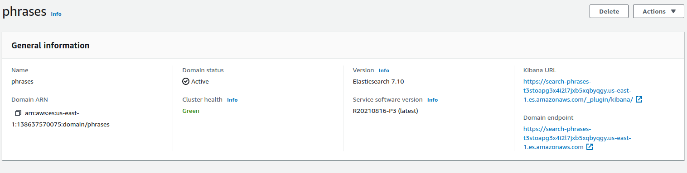
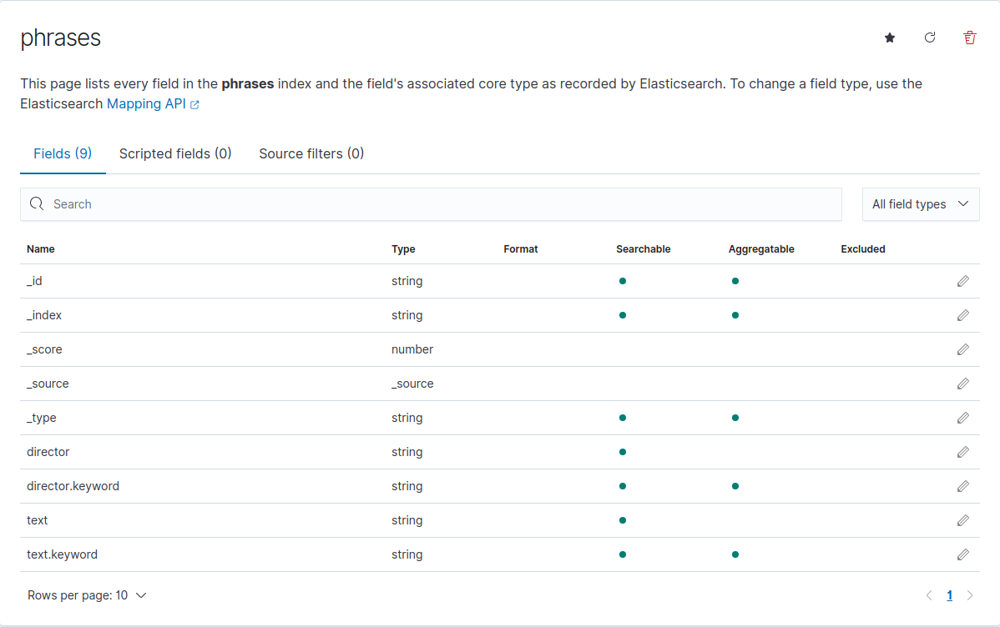

# otus-elasticsearch

### Кластер ES в AWS





### Выгрузка данных

```
curl -XPOST -u 'master-username:master-password' 'https://search-phrases-t3stoapg3x4i2l7jxb5xqbyqgy.us-east-1.es.amazonaws.com/_bulk' --data-binary @phrases.json -H 'Content-Type: application/json'
```

### Запрос данных

```
curl -XGET -u 'master-username:master-password' 'https://search-phrases-t3stoapg3x4i2l7jxb5xqbyqgy.us-east-1.es.amazonaws.com/phrases/_search' -H 'Content-Type: application/json' -d @query.json
```

### Postman коллекция

Ссылка в чате с преподавателем